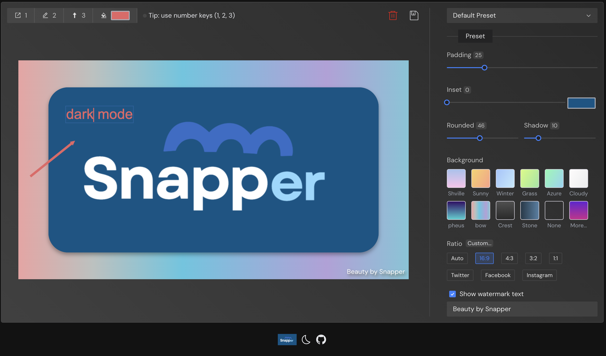

 

</a>

Screenshot tool <b>beautification</b> for <b>every</b>one

  <a href="https://yonghero.github.io/Snapper/">Preview Now 🤘</a> | <a href="https://github.com/Yonghero/Snapper/blob/main/README.md">英文文档</a>

## Features

- 📝 智能化导入导出
- 🎨 强大的图像美化编辑
- 🌎 国际化的语言支持
- 🛠 本地仓库存储

### 📝 智能化导入导出

#### 导入方式

1. 按下Ctrl/Command + V可直接将剪切板内的图片粘入编辑器

2. 支持图片上传

3. 可拖拽图片至编辑器内

#### 导出方式

1.  右上角的export按钮点击自动导出
2.  快捷键ctrl/command + c导出

### 🎨 强大的图像美化编辑

`padding、inset、rounded、shadow、border、background ...`

- 支持自定义修改图片比例尺寸`Ratio` 当然也提供了许多预置比例
- 水印文字自定义

### 🌎 国际化的语言支持

支持中/英文切换

### 🛠 本地仓库存储

- 用于添加和保存预设
- 刷新当前页面不会丢失已编辑图像的状态
