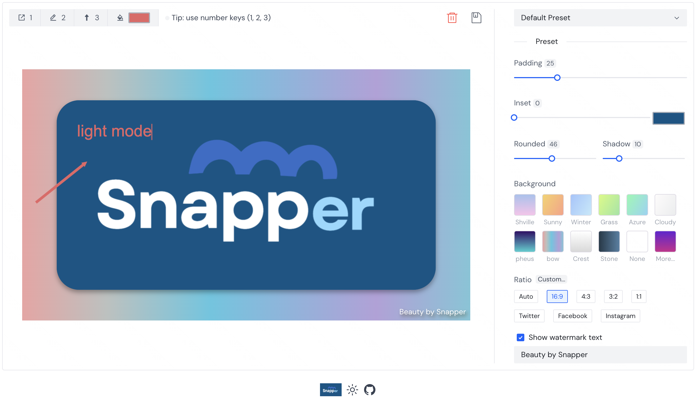
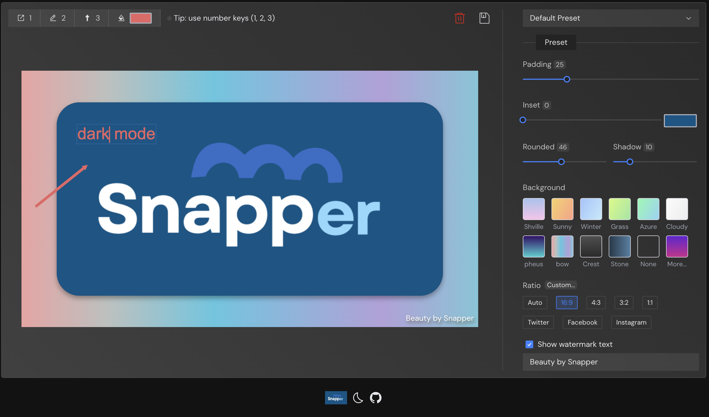

 

</a>

Screenshot tool <b>beautification</b> for <b>every</b>one

  <a href="https://yonghero.github.io/Snapper/">Preview Now 🤘</a>

## Features

- 📝 Intelligent import export
- 🎨 Beautiful image editing
- 🌎 International zh/en
- 🛠 Storage

### 📝 Intelligent import & export

#### how to import ?

1. Press Ctrl/Command+V to directly paste images from the clipboard into the editor

2. Support image upload

3. Can drag images into the editor

#### export ways

1.  Click on the export button in the upper right corner to automatically expor
2.  The shortcut keys ctrl/command + c are exported

### 🎨 Beautiful image editing

`padding、inset、rounded、shadow、border、background ...`

- Support custom modification of image scale size `Ratio`, of course, also provides many preset scales
- Watermark Text Customization

### 🌎 International zh/en

Supports switching between Chinese and English

### 🛠 Storage

- Used to add and save presets Support local storage
- Refreshing the current page will not lose the status of the edited image Support session storage
